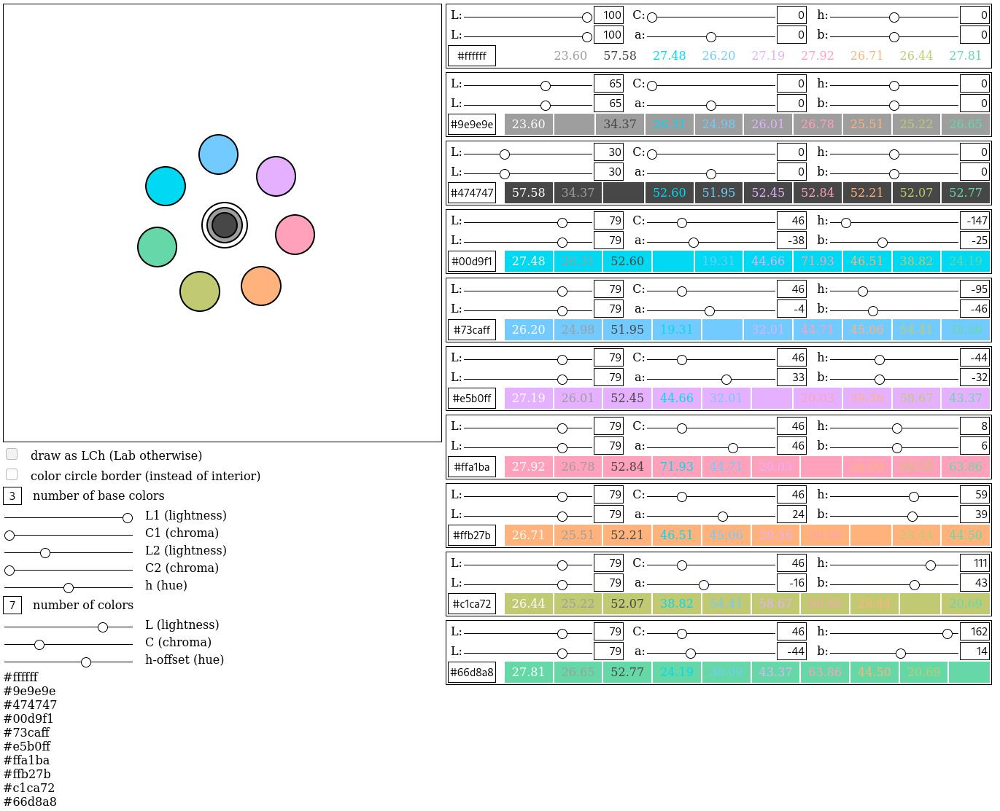

# LCh/Lab Color Palette

Choose your colors using the [LCh/Lab color
space](https://en.wikipedia.org/wiki/CIELAB_color_space#Cylindrical_model).
You can [try it here](https://thobl.github.io/LCh-Lab-color-palette).

## Why the LCh/Lab Color Space?

These color spaces were designed to approximate human vision.  Want to
have different colors that are equally bright?  Fix the lightness and
only vary the hue and/or the chromaticity (saturation).  Want to scale
the same color from dark to light in equal steps?  Fix the hue and
chromaticity and change the lightness in equal steps.  Want to
interpolate between a color and the gray of equal brightness?  Fix the
lightness and the hue and adjust the chromaticity in equal steps.  You
get the idea.

By the way: The LCh color space is the Lab color space but with polar
coordinates.  I find the LCh color space more useful to think in but
the Lab color nicer to look at.

## What are the Colored Numbers?

The colored numbers with colored background show the [CIEDE2000 color
difference](https://en.wikipedia.org/wiki/Color_difference#CIEDE2000)
between the two colors.  It is supposed to difference between two
colors as perceived by humans.

## Why is the UI so Crappy?

Because this was never really meant to be used by anybody but me and
it is good enough for me.

## How can I run it Locally to Change Stuff?

Download the repo.  In the repo folder, run `yarn` to download all the
required packages (this has to be done only once).  Afterwards, you
can start the app by running `yarn start`.
